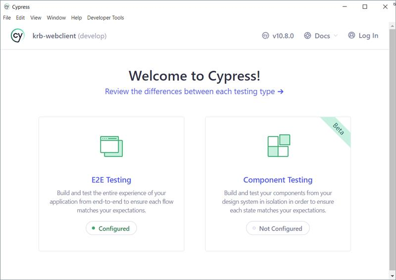
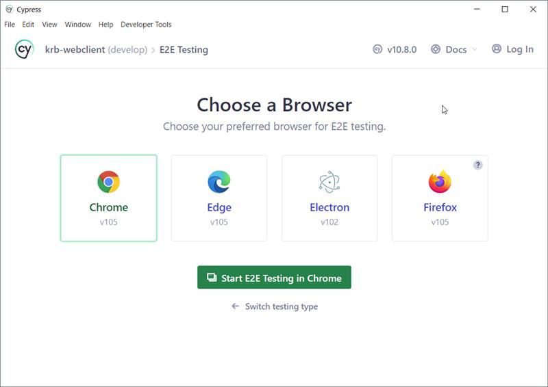
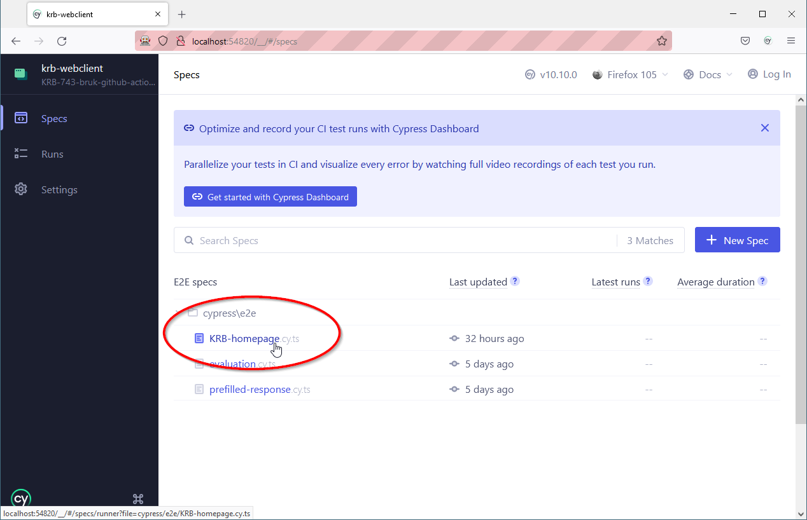
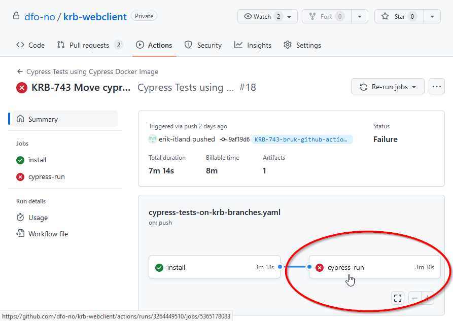
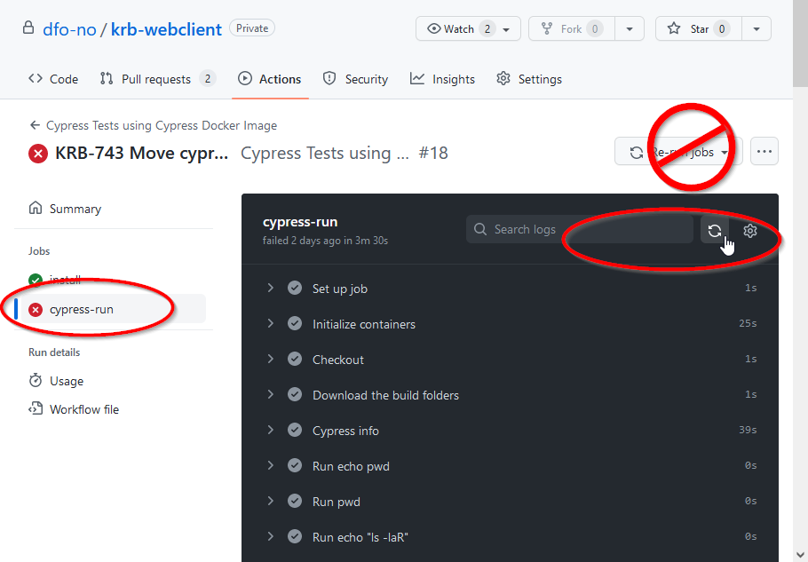

# Kravbank webclient README

This recipe should work for most mainstream OSs, including Windows, Mac and mainstream Linux distros.

## Prerequisites

1. You need the client id in order to run the application. Log onto portal.azure.com and find it under the Kravbank
   application.
2. Create a .env.local file in krb-webclient directory, and add the following lines:

   > REACT_APP_CLIENTID="Key attained from Portal"
   > REACT_APP_API_URL=https://krb-api-man-dev.azure-api.net

## Installation

1. Install Volta if it isn't already installed, see https://docs.volta.sh/guide/getting-started for a short how to. (
   This
   only needs to be done once, afterwards it can be reused for every project.)
2. Make sure you have added a SSH key to your GitHub settings to be able to clone the repository securely.
3. Clone the repository:

   > git clone git@github.com:dfo-no/krb-webclient.git

4. Navigate to the project root directory, and install packages:

   > npm install

5. Install ESLint, Prettier, and SonarLint extensions.
6. Launch the project:

   > npm start

## Using Cypress tests

### The tests runs automatically

Every time new commits are pushed to GitHub a GitHub Action is triggered that runs the latest Cypress tests from the
branch. This workflow is configured in .github/workflows/cypress-tests-on-krb-branches.yaml

You can find the results here: https://github.com/dfo-no/krb-webclient/actions

### The tests can be run locally

To run the tests locally, run `npx cypress open`. This will open a dialog like this:

After choosing E2E, select which browser to use:

And then what test to run:

Once the test has run it will run automatically most of the time every time something changes.

### Troubleshooting

If a test doesn't work and there isn't an obvious reason, sometimes it might help to just restart the test.

This holds true both locally as well as well as in GitHub Actions.

To restart it in GitHub Actions, go to https://github.com/dfo-no/krb-webclient/actions, open the failed job:

... and restart just the job (i.e. part of the workflow) that failed:

